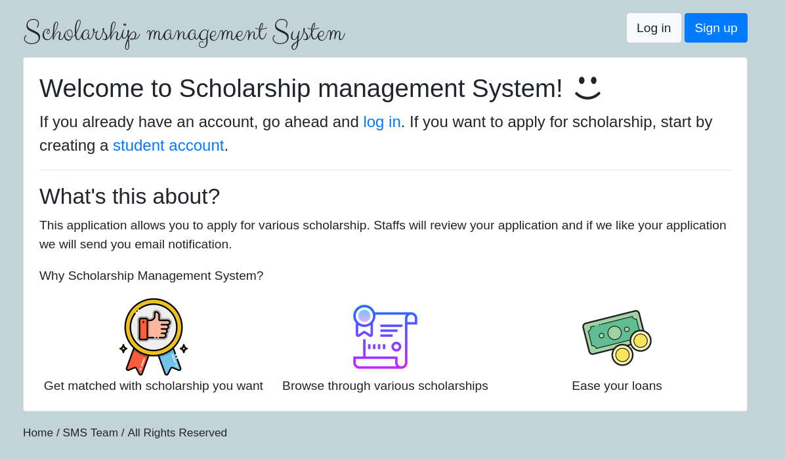
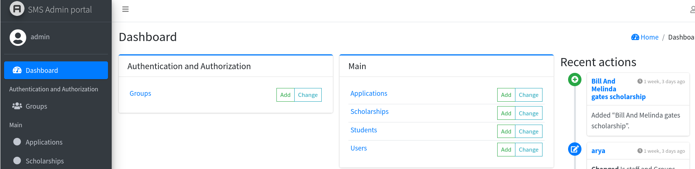
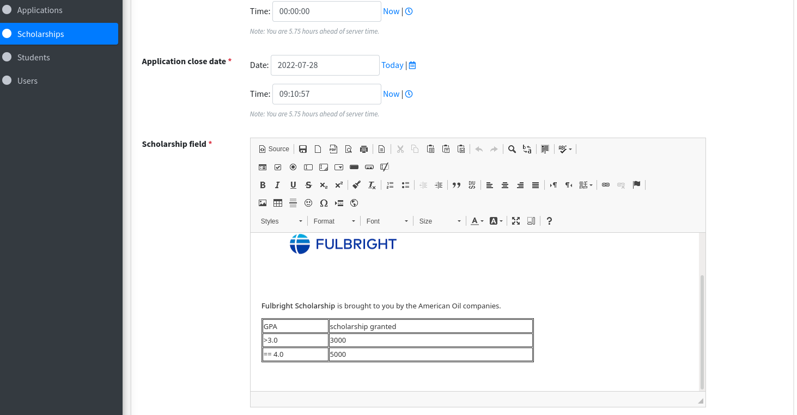

<h1 style="text-align:center">Scholarship Management System</h1>

<center></center>

## Using the Web App 

```
python -m venv ../venv/sms
pip3 install -r requirements.txt

source ../venv/sms/bin/activate.sh (for bash / zsh / sh)
source ../venv/sms/bin/activate.fish (for fish)
../venv/sms/bin/activate.ps (for powershell)

python manage.py migrate
python manage.py run server
```

## Features

- Three tier of Users
    - Students
    - Staffs
    - Superadmin
- Different Dashboard for Student and Staffs
- Students account can be created by anyone. 
- Staff can be created by Admin only.    

## Video Guide 

Click the image below for video guide

[](https://www.youtube.com/watch?v=bNu5_ovwhjc)

## Screenshots

  
  

